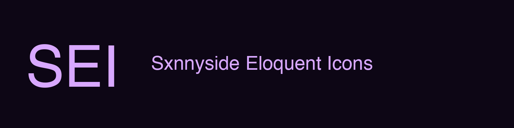
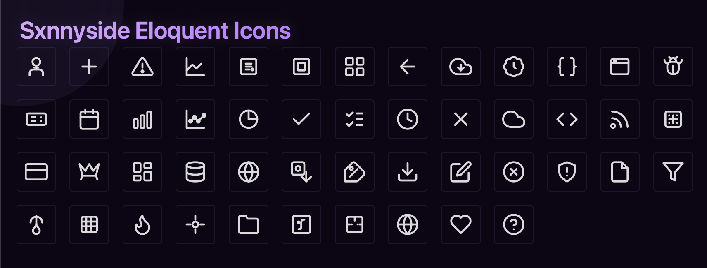

<!-- Banner Placeholder -->

<p align="center">
  
</p>

<h1 align="center">Sxnnyside Eloquent Icons (SEI)</h1>

<p align="center">
  A curated, platform-agnostic icon system designed for clarity, consistency, and long-term evolution.
</p>

<p align="center">
  <!-- Badges -->
  
  
  
  
</p>

---

## What is SEI?

**Sxnnyside Eloquent Icons (SEI)** is a carefully designed SVG icon system built as part of the **Sxnnyside Project ecosystem**.

SEI is not a massive icon catalog. It is a **curated system** where every icon exists because it was needed in a real interface.

The goal is simple:

* Clear visual language
* Strict consistency
* No platform bias
* Long-term maintainability

If an icon does not communicate clearly, it does not belong here.

---

## Philosophy

SEI follows a small set of non-negotiable principles:

* Icons are created **on demand**, not in bulk
* Consistency matters more than quantity
* One concept equals one icon
* Visual rules are enforced, not suggested

You can read the full vision here:

* [Manifesto](docs/manifesto.md)
* [Visual Rules](docs/rules.md)

---

## Icon Preview

<!-- Icons Preview Placeholder -->

<p align="center">
  
</p>

This repository contains the **complete and up-to-date icon set**.

See the full list of available icons here:
[Icon List](docs/icon-list.md)

---

## Open Source

SEI is **free and open-source**.

You are welcome to:

* Use it in personal or commercial projects
* Adapt it to different platforms
* Propose new icons when a real use case exists

Contributions are evaluated based on **coherence and necessity**, not volume.

---

## Platform Agnostic by Design

SEI icons are provided as **clean SVGs**, making them usable across:

* Flutter
* SwiftUI
* Jetpack Compose
* React / Web
* Desktop applications

Framework-specific adapters may exist, but the icon system itself remains neutral.

---

## Repository Structure

```
assets/
 ├─ icons-preview-placeholder.png
 └─ banner-placeholder.png
icons/
 ├─ outline/
 └─ filled/
figma/
 └─ README.md
 docs/
 ├─ manifesto.md
 ├─ rules.md
 └─ icon-list.md
README.md
CODE_OF_CONDCUT.md
CONTRIBUTING.md
LICENSE
```

---

## Why SEI Exists

Most icon libraries optimize for scale.
SEI optimizes for **identity and clarity**.

It exists to support products that care about visual language, not just visual assets.

---

## Sxnnyside Project

SEI is part of the broader **Sxnnyside Project**, an independent ecosystem focused on building tools, applications, and creative systems with strong identity and long-term vision.

---

<p align="center">
  Built with intent. Designed to speak without words.
</p>
