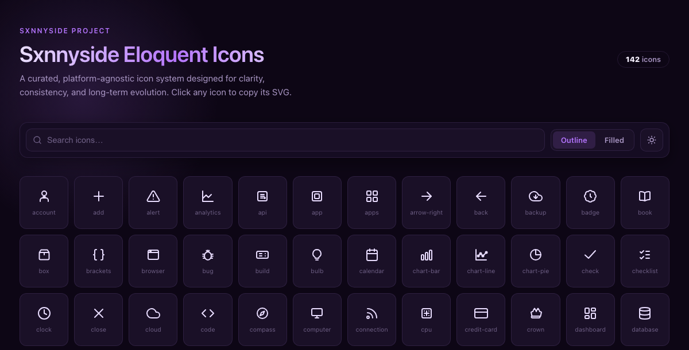

<p align="center">
  
</p>

<h1 align="center">Sxnnyside Eloquent Icons (SEI)</h1>

<p align="center">
  
  
  
  
</p>

<p align="center">
  <strong>Curated ✦ Consistent ✦ Platform-agnostic</strong><br>
  <em>A deliberately small SVG icon system built for clarity and long-term consistency across Web, Flutter, and SwiftUI.</em>
</p>

<p align="center">
  <a href="#about">About</a> ✦
  <a href="#features">Features</a> ✦
  <a href="#installation">Installation</a> ✦
  <a href="#usage">Usage</a> ✦
  <a href="#architecture">Architecture</a> ✦
  <a href="#contributing">Contributing</a>
</p>

---

## About

**Sxnnyside Eloquent Icons (SEI)** is a curated SVG icon system built as part of the Sxnnyside Project ecosystem.

Most icon libraries optimize for scale — thousands of icons, most never used. SEI optimizes for the opposite: a small, deliberate set where every icon exists because a real interface needed it. If you're building a product where visual identity and consistency matter more than having every possible glyph on hand, that's what SEI is for.

Each icon lives on a strict 24×24 grid with a single stroke weight, generous rounding, and true `currentColor` theming — including filled variants that use real transparency (via SVG masks) instead of hardcoded colors, so they render correctly on any background, light or dark, in any consuming app.

### Philosophy

> *"An eloquent icon communicates without explanation."*

Part of the [Sxnnyside Project](https://sxnnysideproject.com).

## Features

- **Two styles**: outline (default) and filled, sharing one visual language.
- **True theming**: every icon uses `currentColor` — no baked-in colors, no recolor hacks, correct in light and dark mode.
- **Platform-agnostic**: plain SVG files, usable directly in Web, Flutter (`flutter_svg`), SwiftUI (as vector assets), or any environment that can render SVG.
- **24×24 grid, single stroke weight**: consistent proportions and rounding across the entire set — see [Visual Rules](docs/rules.md).
- **Live, dependency-free browser**: `demo/` renders and searches the full catalog straight off the filesystem — no build step, no generated files.
- **Deliberately finite**: icons are added on demand, not in bulk. See [Manifesto](docs/manifesto.md).

## Icon Preview

<p align="center">
  
</p>

This is a sample, not the full catalog — browse everything with the [local demo](#usage) or see the [full icon list](docs/icon-list.md).

## Installation

### Prerequisites

- Any environment that can consume `.svg` files (no build tooling required to use the icons themselves).
- [Bun](https://bun.sh) — only needed to run the local demo/browser in `demo/`.

### From Source

```bash
git clone https://github.com/sxnnyside-project/sxnnyside-eloquent-icons.git
cd sxnnyside-eloquent-icons
```

There's nothing to build or install — copy the `.svg` files you need directly from `icons/outline/` or `icons/filled/`, or browse them locally with the demo below.

## Usage

Browse and search the full icon catalog locally:

```bash
bun demo/server.ts
# → http://localhost:4173
```

Click any icon in the browser to copy its SVG markup. Drop the file straight into your project:

```html

```

```html
<!-- inline for currentColor theming -->
<svg viewBox="0 0 24 24" fill="none" stroke="currentColor" stroke-width="2"
     stroke-linecap="round" stroke-linejoin="round" style="color: var(--icon-color)">
  <!-- paste the icon's inner markup -->
</svg>
```

See the [full icon list](docs/icon-list.md) for every available name.

## Architecture

```
sxnnyside-eloquent-icons/
├── icons/          # the icons themselves — outline/ and filled/
├── demo/           # local, dependency-free browser (Bun + htmx)
├── docs/           # manifesto, visual rules, full icon list
├── figma/          # design source reference
└── assets/         # banner and preview images
```

For the visual rules every icon follows, see [docs/rules.md](docs/rules.md).

## Contributing

Contributions are accepted — most commonly as icon requests or icon design contributions. See [CONTRIBUTING.md](CONTRIBUTING.md) for guidelines specific to how SEI grows.

Before contributing, read the [Code of Conduct](CODE_OF_CONDUCT.md).

## License

Sxnnyside Eloquent Icons uses a custom attribution license, not a standard OSI license — see [LICENSE](LICENSE) for the full terms (free to use commercially with attribution; no standalone resale, rebranding, or AI-training use).

---

<p align="center">
  <strong>Sxnnyside Eloquent Icons</strong> — Part of the Sxnnyside Project<br>
  <em>&copy; 2026 Sxnnyside Project</em>
</p>

<p align="center">
  Built with intent. Designed to speak without words.
</p>
